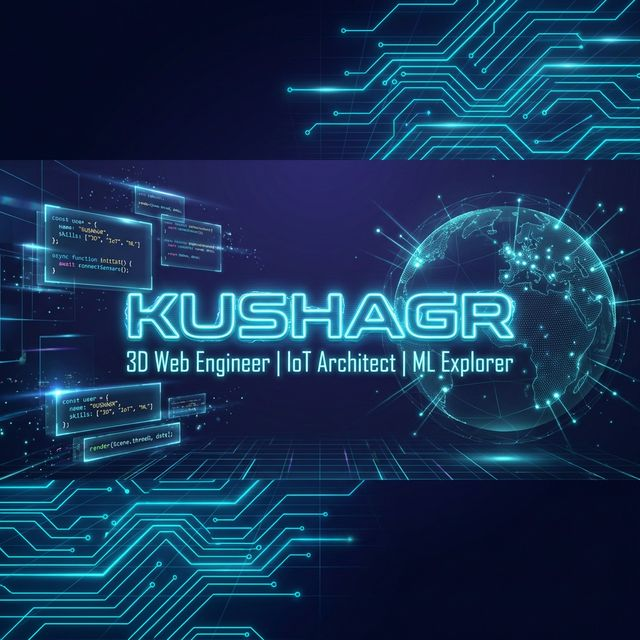

<!-- ╔══════════════════════════════════════════════════════════════════╗ -->
<!-- ║          KUSHAGR27 — CYBERPUNK PROFILE README                   ║ -->
<!-- ║          3D Web Engineer | IoT Architect | ML Explorer          ║ -->
<!-- ╚══════════════════════════════════════════════════════════════════╝ -->

<!-- =================== CYBERPUNK HEADER =================== -->

<p align="center">
  
</p>

<p align="center">
  
</p>

<p align="center">
  
</p>

<p align="center">
  <a href="mailto:27ksr2@gmail.com"></a>
  <a href="https://github.com/KUSHAGR27"></a>
  
</p>

<p align="center">
  
</p>

---

<!-- =================== CYBERSPACE GIF =================== -->

<h2 align="center">
  
  &nbsp; SKILLS: <span style="color: #00f7ff">MAXED OUT</span> &nbsp;
  
</h2>

<br>

<table align="center" border="0" cellpadding="0" cellspacing="0">
<tr>
<td width="50%" align="center">


</td>
<td width="50%">

```js
// ━━━━━━━ SYSTEM PROFILE ━━━━━━━

const KUSHAGR = {
  identity: "3D Creative Full-Stack Developer",
  age: 18,

  core: {
    languages: ["JavaScript", "Python", "C++"],
    frontend:  ["React", "Three.js", "R3F"],
    backend:   ["Node.js", "Express", "REST"],
    database:  ["MongoDB", "Mongoose"],
    iot:       ["ESP32-S3", "LoRa", "Sensors"],
  },

  currently: {
    learning:  ["Machine Learning", "TensorFlow"],
    building:  "Immersive 3D Web Experiences",
    exploring: "Advanced Real-Time Rendering",
  },

  philosophy: "Build. Break. Scale. Repeat.",
};

// STATUS: OPERATIONAL ✅
```

</td>
</tr>
</table>

<br>

---

<!-- =================== 3D WEB ZONE =================== -->

<h2 align="center">🌌 3D WEB EXPERIENCE LAB</h2>

<p align="center">
  
</p>

<table align="center">
<tr>
<td align="center" width="50%">

### ⚡ What I Build
- 🎮 Interactive 3D web environments
- 🌀 Physics-driven camera systems
- 🌍 Immersive spatial experiences
- 🧩 Game-style UI interactions

</td>
<td align="center" width="50%">

### 🛸 Tech Used
- React Three Fiber (R3F)
- Three.js core
- GLSL Shaders
- Rapier Physics Engine
- Post-Processing Effects

</td>
</tr>
</table>

<p align="center">
  
</p>

---

<!-- =================== FEATURED PROJECT: MAGICARP =================== -->

<h2 align="center">🔱 FEATURED SYSTEM: MAGICARP</h2>

<p align="center">
  <b>🌊 Marine Advanced Geospatial Intelligence & Coastal Adaptive Response Platform</b>
</p>

<p align="center">
  
</p>

<table align="center">
<tr>
<td width="60%">

> *A self-healing wireless mesh network of smart buoys that monitor water quality, detect smuggling vessels via computer vision, and relay SOS signals — without relying on cellular networks.*

#### 🧠 System Capabilities
- 📡 **ESP-NOW Mesh Network** — Self-healing IoT communication
- 🌍 **Geospatial Intelligence** — Real-time fleet monitoring
- 🤖 **Computer Vision** — Vessel detection & classification
- 🌊 **Environmental Monitoring** — pH, turbidity, temperature sensors
- � **LoRa Long-Range** — 433MHz + 900MHz relay systems

#### 🛠️ Stack
`ESP32-S3` · `LoRa SX1278` · `React` · `Vite` · `Chart.js` · `Tailwind CSS` · `PlatformIO`

</td>
<td width="40%" align="center">

<a href="https://github.com/KUSHAGR27/MAGICARP--Marine-Advanced-Geospatial-Intelligence-Coastal-Adaptive-Response-Platform">
  
</a>

<br><br>

<a href="https://github.com/KUSHAGR27/MAGICARP--Marine-Advanced-Geospatial-Intelligence-Coastal-Adaptive-Response-Platform">
  
</a>

</td>
</tr>
</table>

---

<!-- =================== IOT SYSTEMS LAB =================== -->

<h2 align="center">🤖 IoT SYSTEMS LAB</h2>

<table align="center">
<tr>
<td align="center" width="50%">


</td>
<td width="50%">

```yaml
# ━━━ IoT SYSTEMS MANIFEST ━━━
platform: ESP32-S3 (Dual-Core, AI-Accelerated)
protocols:
  - ESP-NOW (Mesh Networking)
  - LoRa SX1278 (433MHz Long Range)
  - RFD900X (900MHz Telemetry)
sensors:
  - NEO-6M GPS Module
  - DS18B20 Temperature
  - Analog pH Sensor
  - Turbidity Sensor
environment: PlatformIO
simulation: Wokwi
capability: "Real-time data pipelines,
  hardware-software synergy,
  self-healing mesh networks"
```

</td>
</tr>
</table>

---

<!-- =================== ML PROTOCOL =================== -->

<h2 align="center">🧠 MACHINE LEARNING PROTOCOL — <code>IN TRAINING</code></h2>

<p align="center">
  
</p>

<table align="center">
<tr>
<td align="center">� Model Experimentation</td>
<td align="center">🧮 Algorithm Foundations</td>
<td align="center">🤖 TensorFlow Exploration</td>
<td align="center">📈 Data-Driven Thinking</td>
</tr>
</table>

<p align="center"><i>"The next layer of intelligence is being compiled..."</i></p>

---

<!-- =================== TECH ARSENAL =================== -->

<h2 align="center">🛡️ TECH ARSENAL</h2>

<p align="center">
  
</p>

<table align="center">
<tr>
<td align="center"><b>⚡ CORE</b></td>
<td align="center"><b>🌌 3D / CREATIVE</b></td>
<td align="center"><b>🤖 IoT / SYSTEMS</b></td>
<td align="center"><b>🧠 EXPLORING</b></td>
</tr>
<tr>
<td align="center">
  
</td>
<td align="center">
  
</td>
<td align="center">
  
</td>
<td align="center">
  
</td>
</tr>
</table>

<br>

<p align="center">
  
</p>

<p align="center">
  
</p>

---

<!-- =================== GITHUB INTELLIGENCE PANEL =================== -->

<h2 align="center">📡 GITHUB INTELLIGENCE PANEL</h2>

<p align="center">
  
</p>

<p align="center">
  
  
</p>

<p align="center">
  
</p>

---

<!-- =================== CONTRIBUTION SNAKE =================== -->

<h2 align="center">🐍 CYBER CONTRIBUTION MATRIX</h2>

> [!NOTE]
> The snake animation is generated automatically by GitHub Actions. If it is broken, it implies the action hasn't successfully run yet. Once pushed to GitHub, trigger the **Generate Snake Animation** workflow manually from the Actions tab or wait for the nightly run to generate it.

<p align="center">
  <picture>
    <source media="(prefers-color-scheme: dark)" srcset="https://raw.githubusercontent.com/KUSHAGR27/KUSHAGR27/output/github-snake-dark.svg" />
    <source media="(prefers-color-scheme: light)" srcset="https://raw.githubusercontent.com/KUSHAGR27/KUSHAGR27/output/github-contribution-grid-snake.svg" />
    
  </picture>
</p>

---

<!-- =================== TROPHY CASE =================== -->

<h2 align="center">🏆 GITHUB PROFILE SUMMARY</h2>

<p align="center">
  
</p>

---

<!-- =================== 2026 OBJECTIVES =================== -->

<h2 align="center">🎯 2026 MISSION OBJECTIVES</h2>

<table align="center">
<tr>
<td>

```diff
+ 🌌 Master advanced 3D real-time rendering (R3F + GLSL)
+ 🧠 Build ML-powered interactive web systems
+ ⚙️ Contribute to major open-source projects
+ 🏆 Win elite-tier hackathons
+ 📡 Push IoT mesh networking to new limits
```

</td>
</tr>
</table>

---

<!-- =================== CONNECT =================== -->

<h2 align="center">🌐 WAYS TO CONNECT :- </h2>

<p align="center">
  <a href="mailto:27ksr2@gmail.com">
    
  </a>
  &nbsp;
  <a href="https://github.com/KUSHAGR27">
    
  </a>
</p>

<br>

<p align="center">
  
</p>

---

<!-- =================== FOOTER =================== -->

<p align="center">
  
</p>

<p align="center">
  
</p>
